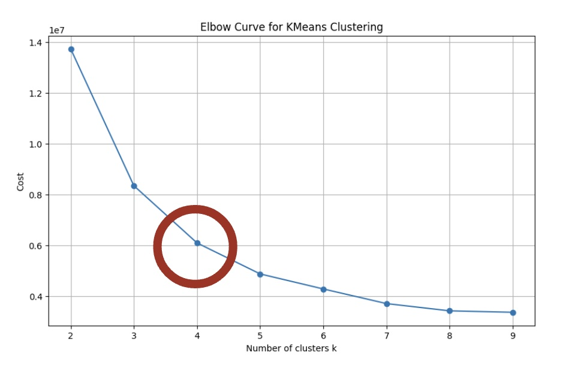
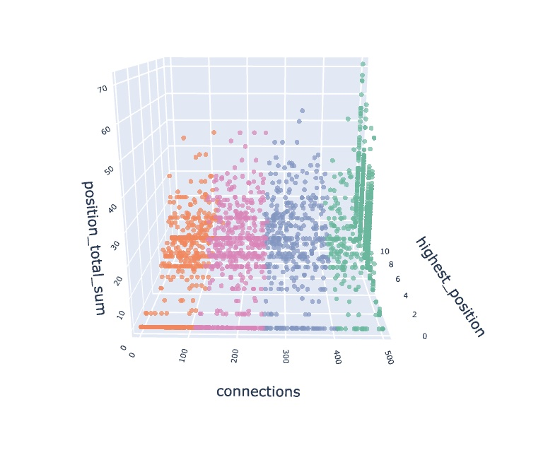
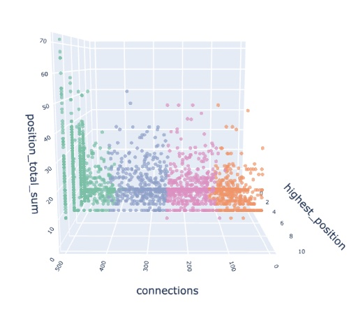
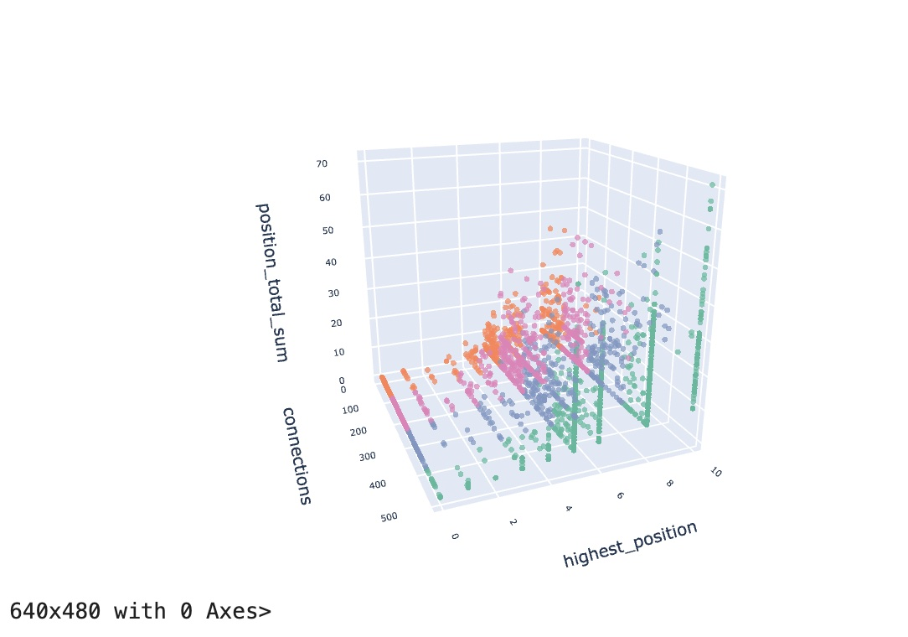

# LinkedIn: Navigating Career Success - CS777 Term Project - Team 9

## Getting Started
After cloning this repo, run the following commands from the root directory:

1. Set up a python virtual env by running: `python -m venv venv`
2. Activate the virtual venv: `source venv/bin/activate`
3. Install the required dependencies: `pip3 install -r requirements.txt`

## Environment Set Up
The code was executed in Google Collab with the data stored on the drives.

## How to run the code
Ensure that the required libraries are installed and the data is present at the drive location mentioned in the code.

## Our Data
We decided to scrape LinkedIn public profiles for our dataset. We have structured our dataset into the following JSON structure.

Using PySpark we were to read in the structured data, load into a dataframe and rdd and run analysis.

Dataset can be found here: `s3://metcs777-termproject-team9/data/raw_data_large.tar.gz`

```python
root
 |-- activity: struct (nullable = true)
 |    |-- connections: string (nullable = true)
 |    |-- followers: string (nullable = true)
 |-- education: array (nullable = true)
 |    |-- element: struct (containsNull = true)
 |    |    |-- dates_attended: struct (nullable = true)
 |    |    |    |-- end: string (nullable = true)
 |    |    |    |-- start: string (nullable = true)
 |    |    |    |-- total_time: string (nullable = true)
 |    |    |-- degree: array (nullable = true)
 |    |    |    |-- element: array (containsNull = true)
 |    |    |    |    |-- element: string (containsNull = true)
 |    |    |-- school_name: string (nullable = true)
 |-- education_count: long (nullable = true)
 |-- experience_count: long (nullable = true)
 |-- experiences: array (nullable = true)
 |    |-- element: struct (containsNull = true)
 |    |    |-- company_name: string (nullable = true)
 |    |    |-- positions: array (nullable = true)
 |    |    |    |-- element: struct (containsNull = true)
 |    |    |    |    |-- description: string (nullable = true)
 |    |    |    |    |-- end: string (nullable = true)
 |    |    |    |    |-- job_title: string (nullable = true)
 |    |    |    |    |-- start: string (nullable = true)
 |    |    |    |    |-- total_duration: string (nullable = true)
 |-- id: string (nullable = true)
 |-- last_generated_at: string (nullable = true)
 |-- skills: array (nullable = true)
 |    |-- element: string (containsNull = true)
 |-- skills_count: long (nullable = true)
```

## The Results
We decided to train our data using two seperate approaches, a supervised learning approach and an unsupervised learning approach.
The final report will go into more details about the specifics, but results and outputs for boths models can be found here:

**Model 1:** [Decision Tree Classifier Outputs](Prediction_using_dt_classifier.ipynb)

**Model 2:** [K-Means Clustering Outputs](clustering_using_kmeans.ipynb)

### Finding Optimal K


### Clustering Results




